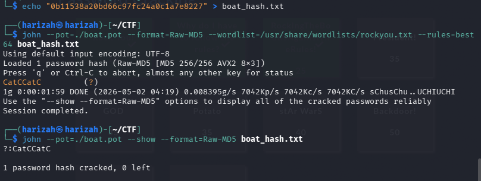

# boat_hash

> The official challenge title was not preserved in the source document. This section uses the local filename `boat_hash.txt`.

Hash:

```text
0b11538a20bd66c9f7c24a0c1a7e8227
```

The preserved solve uses Raw MD5, `rockyou.txt`, and John's `best64` rules:

```bash
echo "0b11538a20bd66c9f7c24a0c1a7e8227" > boat_hash.txt

john --pot=./boat.pot   --format=Raw-MD5   --wordlist=/usr/share/wordlists/rockyou.txt   --rules=best64   boat_hash.txt

john --pot=./boat.pot --show --format=Raw-MD5 boat_hash.txt
```



Recovered password:

```text
CatCCatC
```
