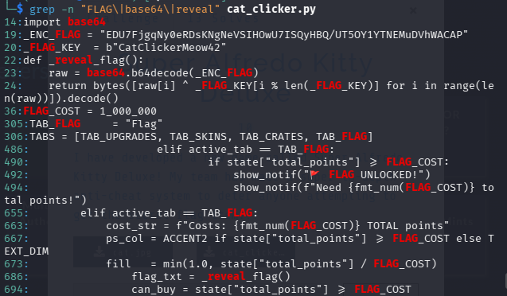
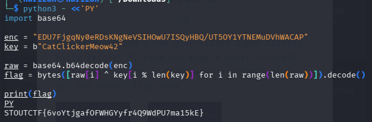

# Cat Clicker

The source contains an encoded flag and a static key:

```python
_ENC_FLAG = "EDU7FjgqNy0eRDsKNgNeVSIHOwU7ISQyHBQ/UT5OY1YTNEMuDVhWACAP"
_FLAG_KEY = b"CatClickerMeow42"
```

The reveal logic Base64-decodes the ciphertext and XORs every byte with the repeating key.



Run the included solver:

```bash
python3 solve.py
```



## Flag

```text
STOUTCTF{6voYtjgafOFWHGYyfr4Q9WdPU7ma15kE}
```
