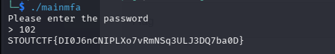

# mainmfa

> The official challenge title was not preserved in the source document. This entry uses the binary name `mainmfa`.

The preserved analysis found checks equivalent to:

```text
value > 100
value <= 199
value is even
```

The write-up used `102`.

```bash
./mainmfa
```

Input:

```text
102
```



## Flag

```text
STOUTCTF{DI0J6nCNIPLXo7vRmNSq3ULJ3DQ7ba0D}
```
