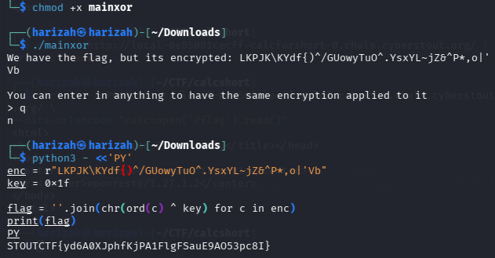

# mainxor

> The official challenge title was not preserved in the source document. This entry uses the binary name `mainxor`.

Running the binary revealed an encrypted flag and stated that entered text receives the same encryption. The preserved solve applies a single-byte XOR using key `0x1f`.



## Flag

```text
STOUTCTF{yd6A0XJphfKjPA1FlgFSauE9AO53pc8I}
```

> The original encrypted string is preserved in the screenshot above; the Word write-up did not retain it as clean text, so I have not reconstructed a separate solver file here.
