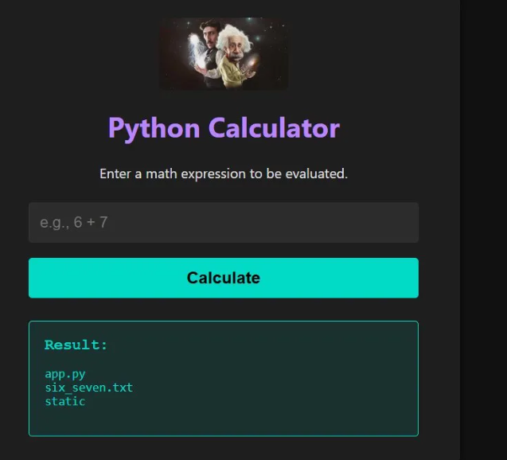
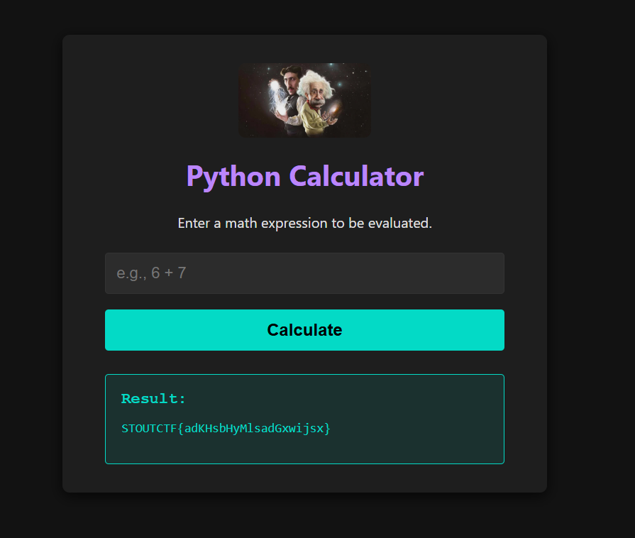

# Python Calculator

The source document preserves result screenshots but does **not** preserve the exploit payload or complete methodology. This section therefore records only what the source supports.

The first screenshot shows a directory-style result containing:

```text
app.py
six_seven.txt
static
```



The second screenshot shows the recovered flag:



## Flag

```text
STOUTCTF{adKHsbhYMlsadGxwijsx}
```

> The exact payload/steps should be added later if the original notes are recovered.
